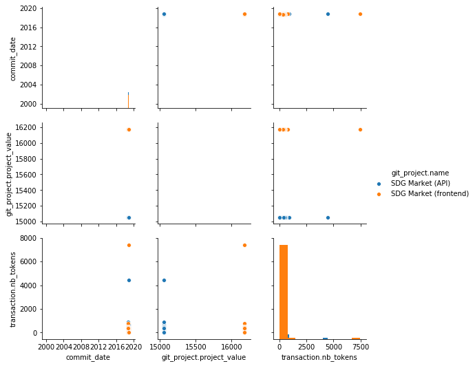
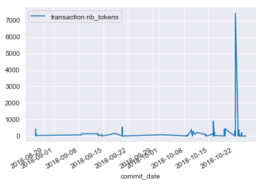
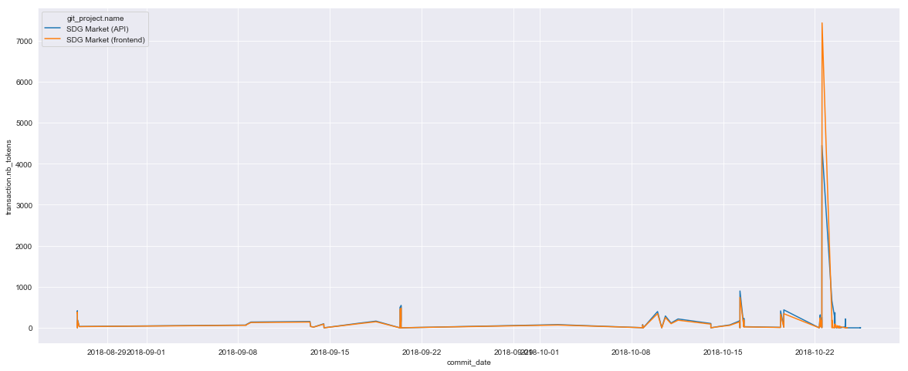
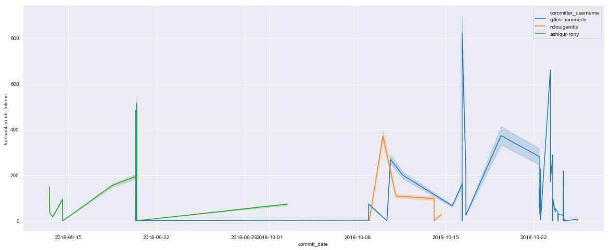

```python
import requests
import pandas as pd
from pandas.io.json import json_normalize

url = "https://sdg-market.oniabsis.com/api/v1/contributions"
try:
    r = requests.get(url)
except requests.ConnectionError:
    print("Connection failed")
```


```python
r.headers
```


    {'Server': 'nginx/1.10.3', 'Date': 'Tue, 27 Nov 2018 09:32:25 GMT', 'Content-Type': 'application/json', 'Transfer-Encoding': 'chunked', 'Connection': 'keep-alive', 'Cache-Control': 'no-cache, private'}


```python
#the json data recieved has many levels json_normalize flattens this structure
df = json_normalize(r.json())
df.columns
```


    Index(['calculation_utc_datetime', 'commit_date', 'commit_id',
           'committer_email', 'committer_username', 'git_project.active',
           'git_project.git_address', 'git_project.id', 'git_project.name',
           'git_project.project_address', 'git_project.project_value', 'id',
           'transaction.from_user', 'transaction.id', 'transaction.nb_sdg',
           'transaction.nb_tokens', 'transaction.project.active',
           'transaction.project.git_address', 'transaction.project.id',
           'transaction.project.name', 'transaction.project.project_address',
           'transaction.project.project_value', 'transaction.sell_offer',
           'transaction.to_user', 'transaction.to_user.access_token',
           'transaction.to_user.active', 'transaction.to_user.black_listed',
           'transaction.to_user.email', 'transaction.to_user.github_id',
           'transaction.to_user.id', 'transaction.to_user.name',
           'transaction.to_user.roles', 'transaction.to_user.timezone',
           'transaction.to_user.username', 'transaction.transaction_label'],
          dtype='object')


## Important to note perhaps user don't want their emails shared so drop that column before anything...


```python
#df.drop takes two parameters the column or row string followed by 0 for rows or 1 for columns
df = df.drop('committer_email',1).drop('transaction.to_user.email',1)
df.sample(5)
```


<div>
<style scoped>
    .dataframe tbody tr th:only-of-type {
        vertical-align: middle;
    }

    .dataframe tbody tr th {
        vertical-align: top;
    }

    .dataframe thead th {
        text-align: right;
    }
</style>
<table border="1" class="dataframe">
  <thead>
    <tr style="text-align: right;">
      <th></th>
      <th>calculation_utc_datetime</th>
      <th>commit_date</th>
      <th>commit_id</th>
      <th>committer_username</th>
      <th>git_project.active</th>
      <th>git_project.git_address</th>
      <th>git_project.id</th>
      <th>git_project.name</th>
      <th>git_project.project_address</th>
      <th>git_project.project_value</th>
      <th>...</th>
      <th>transaction.to_user.access_token</th>
      <th>transaction.to_user.active</th>
      <th>transaction.to_user.black_listed</th>
      <th>transaction.to_user.github_id</th>
      <th>transaction.to_user.id</th>
      <th>transaction.to_user.name</th>
      <th>transaction.to_user.roles</th>
      <th>transaction.to_user.timezone</th>
      <th>transaction.to_user.username</th>
      <th>transaction.transaction_label</th>
    </tr>
  </thead>
  <tbody>
    <tr>
      <th>102</th>
      <td>2018-10-24T08:54:43+00:00</td>
      <td>2018-10-16T06:52:59+00:00</td>
      <td>d644938104bc8a83019647fc0c5234c5f225b39f</td>
      <td>gilles-hemmerle</td>
      <td>True</td>
      <td>https://github.com/sdgsolutionspace/sdg-market...</td>
      <td>2</td>
      <td>SDG Market (frontend)</td>
      <td>https://github.com/sdgsolutionspace/sdg-market...</td>
      <td>16175</td>
      <td>...</td>
      <td>dfcc6a9a5a96266c847d63857f4dc6b63310459d</td>
      <td>True</td>
      <td>False</td>
      <td>2291800</td>
      <td>1.0</td>
      <td>Gilles Hemmerlé</td>
      <td>[ROLE_ADMIN]</td>
      <td>Europe/Paris</td>
      <td>gilles-hemmerle</td>
      <td>Project contribution</td>
    </tr>
    <tr>
      <th>140</th>
      <td>2018-10-24T08:54:51+00:00</td>
      <td>2018-08-26T17:37:36+00:00</td>
      <td>16485179cb2cdc1dfd137fd64bcaf61f6324871a</td>
      <td>None</td>
      <td>True</td>
      <td>https://github.com/sdgsolutionspace/sdg-market...</td>
      <td>2</td>
      <td>SDG Market (frontend)</td>
      <td>https://github.com/sdgsolutionspace/sdg-market...</td>
      <td>16175</td>
      <td>...</td>
      <td>NaN</td>
      <td>NaN</td>
      <td>NaN</td>
      <td>NaN</td>
      <td>NaN</td>
      <td>NaN</td>
      <td>NaN</td>
      <td>NaN</td>
      <td>NaN</td>
      <td>Project contribution</td>
    </tr>
    <tr>
      <th>60</th>
      <td>2018-10-24T08:54:33+00:00</td>
      <td>2018-08-26T20:53:43+00:00</td>
      <td>890802917ef240205aa3ac4414a1d127b790944e</td>
      <td>None</td>
      <td>True</td>
      <td>https://github.com/sdgsolutionspace/sdg-market...</td>
      <td>1</td>
      <td>SDG Market (API)</td>
      <td>https://github.com/sdgsolutionspace/sdg-market...</td>
      <td>15055</td>
      <td>...</td>
      <td>NaN</td>
      <td>NaN</td>
      <td>NaN</td>
      <td>NaN</td>
      <td>NaN</td>
      <td>NaN</td>
      <td>NaN</td>
      <td>NaN</td>
      <td>NaN</td>
      <td>Project contribution</td>
    </tr>
    <tr>
      <th>152</th>
      <td>2018-10-25T12:19:19+00:00</td>
      <td>2018-10-25T10:39:15+00:00</td>
      <td>0535d9bae72debac271c8ab612eed7b04dacabfa</td>
      <td>gilles-hemmerle</td>
      <td>True</td>
      <td>https://github.com/sdgsolutionspace/sdg-market...</td>
      <td>1</td>
      <td>SDG Market (API)</td>
      <td>https://github.com/sdgsolutionspace/sdg-market...</td>
      <td>15055</td>
      <td>...</td>
      <td>dfcc6a9a5a96266c847d63857f4dc6b63310459d</td>
      <td>True</td>
      <td>False</td>
      <td>2291800</td>
      <td>1.0</td>
      <td>Gilles Hemmerlé</td>
      <td>[ROLE_ADMIN]</td>
      <td>Europe/Paris</td>
      <td>gilles-hemmerle</td>
      <td>Project contribution</td>
    </tr>
    <tr>
      <th>0</th>
      <td>2018-10-24T08:54:18+00:00</td>
      <td>2018-10-24T08:27:10+00:00</td>
      <td>f3048503cd1793bd4c1afed8fe9af54a4477298c</td>
      <td>gilles-hemmerle</td>
      <td>True</td>
      <td>https://github.com/sdgsolutionspace/sdg-market...</td>
      <td>1</td>
      <td>SDG Market (API)</td>
      <td>https://github.com/sdgsolutionspace/sdg-market...</td>
      <td>15055</td>
      <td>...</td>
      <td>dfcc6a9a5a96266c847d63857f4dc6b63310459d</td>
      <td>True</td>
      <td>False</td>
      <td>2291800</td>
      <td>1.0</td>
      <td>Gilles Hemmerlé</td>
      <td>[ROLE_ADMIN]</td>
      <td>Europe/Paris</td>
      <td>gilles-hemmerle</td>
      <td>Project contribution</td>
    </tr>
  </tbody>
</table>
<p>5 rows × 33 columns</p>
</div>


```python
#Further cleaning we don't need the calculation date, activity of the project is always true in our test cases
df = df.drop('calculation_utc_datetime', 1).drop('git_project.active', 1)
df.sample(5)
```


<div>
<style scoped>
    .dataframe tbody tr th:only-of-type {
        vertical-align: middle;
    }

    .dataframe tbody tr th {
        vertical-align: top;
    }

    .dataframe thead th {
        text-align: right;
    }
</style>
<table border="1" class="dataframe">
  <thead>
    <tr style="text-align: right;">
      <th></th>
      <th>commit_date</th>
      <th>commit_id</th>
      <th>committer_username</th>
      <th>git_project.git_address</th>
      <th>git_project.id</th>
      <th>git_project.name</th>
      <th>git_project.project_address</th>
      <th>git_project.project_value</th>
      <th>id</th>
      <th>transaction.from_user</th>
      <th>...</th>
      <th>transaction.to_user.access_token</th>
      <th>transaction.to_user.active</th>
      <th>transaction.to_user.black_listed</th>
      <th>transaction.to_user.github_id</th>
      <th>transaction.to_user.id</th>
      <th>transaction.to_user.name</th>
      <th>transaction.to_user.roles</th>
      <th>transaction.to_user.timezone</th>
      <th>transaction.to_user.username</th>
      <th>transaction.transaction_label</th>
    </tr>
  </thead>
  <tbody>
    <tr>
      <th>78</th>
      <td>2018-10-23T14:46:48+00:00</td>
      <td>b5f245362fe407e13f76197bd14057b4d3e394c0</td>
      <td>None</td>
      <td>https://github.com/sdgsolutionspace/sdg-market...</td>
      <td>2</td>
      <td>SDG Market (frontend)</td>
      <td>https://github.com/sdgsolutionspace/sdg-market...</td>
      <td>16175</td>
      <td>79</td>
      <td>None</td>
      <td>...</td>
      <td>NaN</td>
      <td>NaN</td>
      <td>NaN</td>
      <td>NaN</td>
      <td>NaN</td>
      <td>NaN</td>
      <td>NaN</td>
      <td>NaN</td>
      <td>NaN</td>
      <td>Project contribution</td>
    </tr>
    <tr>
      <th>17</th>
      <td>2018-10-22T09:51:42+00:00</td>
      <td>cadb808455b8c8b8aeeb0122772c7bbf66ad2924</td>
      <td>gilles-hemmerle</td>
      <td>https://github.com/sdgsolutionspace/sdg-market...</td>
      <td>1</td>
      <td>SDG Market (API)</td>
      <td>https://github.com/sdgsolutionspace/sdg-market...</td>
      <td>15055</td>
      <td>18</td>
      <td>None</td>
      <td>...</td>
      <td>dfcc6a9a5a96266c847d63857f4dc6b63310459d</td>
      <td>True</td>
      <td>False</td>
      <td>2291800</td>
      <td>1.0</td>
      <td>Gilles Hemmerlé</td>
      <td>[ROLE_ADMIN]</td>
      <td>Europe/Paris</td>
      <td>gilles-hemmerle</td>
      <td>Project contribution</td>
    </tr>
    <tr>
      <th>86</th>
      <td>2018-10-23T07:21:43+00:00</td>
      <td>a88db98354c1b26b3d26202a23b29269ea00bd3d</td>
      <td>None</td>
      <td>https://github.com/sdgsolutionspace/sdg-market...</td>
      <td>2</td>
      <td>SDG Market (frontend)</td>
      <td>https://github.com/sdgsolutionspace/sdg-market...</td>
      <td>16175</td>
      <td>87</td>
      <td>None</td>
      <td>...</td>
      <td>NaN</td>
      <td>NaN</td>
      <td>NaN</td>
      <td>NaN</td>
      <td>NaN</td>
      <td>NaN</td>
      <td>NaN</td>
      <td>NaN</td>
      <td>NaN</td>
      <td>Project contribution</td>
    </tr>
    <tr>
      <th>49</th>
      <td>2018-09-20T08:08:06+00:00</td>
      <td>dfdbbd3fba6c4ac677b3935e1a5dcce590a6bf45</td>
      <td>gilles-hemmerle</td>
      <td>https://github.com/sdgsolutionspace/sdg-market...</td>
      <td>1</td>
      <td>SDG Market (API)</td>
      <td>https://github.com/sdgsolutionspace/sdg-market...</td>
      <td>15055</td>
      <td>50</td>
      <td>None</td>
      <td>...</td>
      <td>dfcc6a9a5a96266c847d63857f4dc6b63310459d</td>
      <td>True</td>
      <td>False</td>
      <td>2291800</td>
      <td>1.0</td>
      <td>Gilles Hemmerlé</td>
      <td>[ROLE_ADMIN]</td>
      <td>Europe/Paris</td>
      <td>gilles-hemmerle</td>
      <td>Project contribution</td>
    </tr>
    <tr>
      <th>41</th>
      <td>2018-10-08T20:40:35+00:00</td>
      <td>79606af49ff489834d744810a2070c1827bc9452</td>
      <td>gilles-hemmerle</td>
      <td>https://github.com/sdgsolutionspace/sdg-market...</td>
      <td>1</td>
      <td>SDG Market (API)</td>
      <td>https://github.com/sdgsolutionspace/sdg-market...</td>
      <td>15055</td>
      <td>42</td>
      <td>None</td>
      <td>...</td>
      <td>dfcc6a9a5a96266c847d63857f4dc6b63310459d</td>
      <td>True</td>
      <td>False</td>
      <td>2291800</td>
      <td>1.0</td>
      <td>Gilles Hemmerlé</td>
      <td>[ROLE_ADMIN]</td>
      <td>Europe/Paris</td>
      <td>gilles-hemmerle</td>
      <td>Project contribution</td>
    </tr>
  </tbody>
</table>
<p>5 rows × 31 columns</p>
</div>


```python
import matplotlib as plt
import seaborn as sns
```


```python
from datetime import date
df['commit_date'] = pd.to_datetime(df['commit_date'])
plotlist = ['commit_date', 'git_project.project_value','transaction.nb_tokens']

sns.pairplot(df, vars=plotlist, hue='committer_username', diag_kind='hist')
```


    <seaborn.axisgrid.PairGrid at 0x221c666a320>


```python
sns.pairplot(df, vars=plotlist, hue='git_project.name', diag_kind='hist')
```


    <seaborn.axisgrid.PairGrid at 0x221ca397f60>





### Let me plot the dates separately since they are not really evident to see in the pairplot


```python
df[['commit_date', 'transaction.nb_tokens']].set_index('commit_date').plot()
```


    <matplotlib.axes._subplots.AxesSubplot at 0x221c66b32b0>


    <Figure size 1440x576 with 0 Axes>





```python
sns.set_style('darkgrid')
plt.pyplot.figure(figsize=(20,8))
sns.lineplot(x='commit_date', y='transaction.nb_tokens', data=df, hue='git_project.name')
```


    <matplotlib.axes._subplots.AxesSubplot at 0x221c8e0abe0>





```python
plt.pyplot.figure(figsize=(20,8))
sns.lineplot(x='commit_date', y='transaction.nb_tokens', data=df, hue='committer_username')
```


    <matplotlib.axes._subplots.AxesSubplot at 0x221c6942da0>





```python

```
