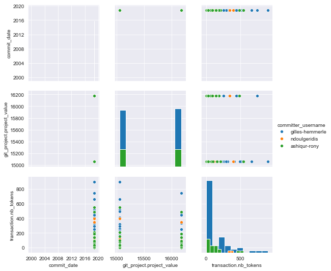
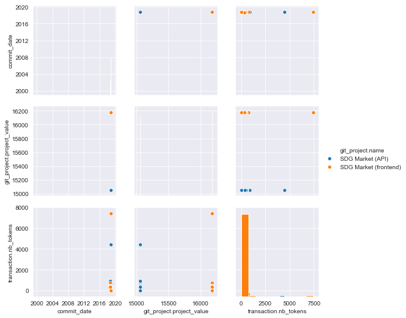
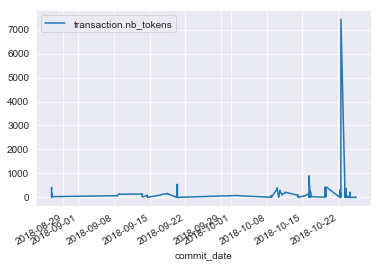
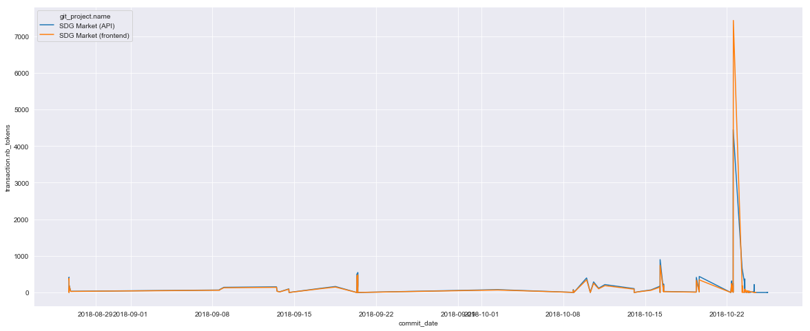
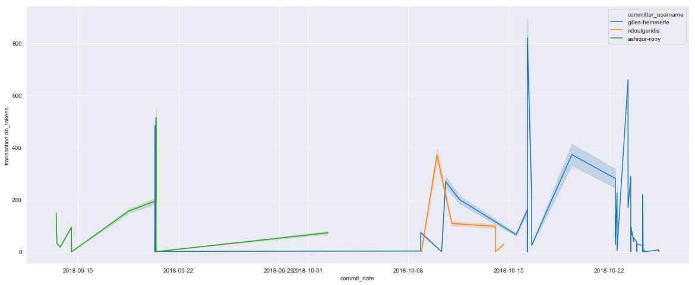

# Output of Jupyter notebook
## Aim is to visualise contributions to tracked projects

### Start by retrieving the data
```python
import requests
import pandas as pd
from pandas.io.json import json_normalize

url = "https://sdg-market.oniabsis.com/api/v1/contributions"
try:
    r = requests.get(url)
except requests.ConnectionError:
    print("Connection failed")
```


```python
r.headers
```


    {'Server': 'nginx/1.10.3', 'Date': 'Wed, 28 Nov 2018 18:52:51 GMT', 'Content-Type': 'application/json', 'Transfer-Encoding': 'chunked', 'Connection': 'keep-alive', 'Cache-Control': 'no-cache, private'}


### Convert the data to json and then import into a pandas dataframe

```python
#the json data recieved has many levels json_normalize flattens this structure
df = json_normalize(r.json())
df.columns
```


    Index(['calculation_utc_datetime', 'commit_date', 'commit_id',
           'committer_email', 'committer_username', 'git_project.active',
           'git_project.git_address', 'git_project.id', 'git_project.name',
           'git_project.project_address', 'git_project.project_value', 'id',
           'transaction.from_user', 'transaction.id', 'transaction.nb_sdg',
           'transaction.nb_tokens', 'transaction.project.active',
           'transaction.project.git_address', 'transaction.project.id',
           'transaction.project.name', 'transaction.project.project_address',
           'transaction.project.project_value', 'transaction.sell_offer',
           'transaction.to_user', 'transaction.to_user.access_token',
           'transaction.to_user.active', 'transaction.to_user.black_listed',
           'transaction.to_user.email', 'transaction.to_user.github_id',
           'transaction.to_user.id', 'transaction.to_user.name',
           'transaction.to_user.roles', 'transaction.to_user.timezone',
           'transaction.to_user.username', 'transaction.transaction_label'],
          dtype='object')


## Important to note perhaps user don't want their emails shared for example so clean up a little


```python
# The list of features we are actually going to use the other categorical values can be used as hues
plotlist = ['commit_date', 'git_project.project_value','transaction.nb_tokens']
df[plotlist].sample(5)
```


<div>
<style scoped>
    .dataframe tbody tr th:only-of-type {
        vertical-align: middle;
    }

    .dataframe tbody tr th {
        vertical-align: top;
    }

    .dataframe thead th {
        text-align: right;
    }
</style>
<table border="1" class="dataframe">
  <thead>
    <tr style="text-align: right;">
      <th></th>
      <th>commit_date</th>
      <th>git_project.project_value</th>
      <th>transaction.nb_tokens</th>
    </tr>
  </thead>
  <tbody>
    <tr>
      <th>124</th>
      <td>2018-09-20T08:49:21+00:00</td>
      <td>16175</td>
      <td>443.23</td>
    </tr>
    <tr>
      <th>47</th>
      <td>2018-09-20T08:49:57+00:00</td>
      <td>15055</td>
      <td>511.34</td>
    </tr>
    <tr>
      <th>104</th>
      <td>2018-10-16T06:46:22+00:00</td>
      <td>16175</td>
      <td>147.04</td>
    </tr>
    <tr>
      <th>131</th>
      <td>2018-09-13T12:40:52+00:00</td>
      <td>16175</td>
      <td>31.86</td>
    </tr>
    <tr>
      <th>93</th>
      <td>2018-10-22T09:51:42+00:00</td>
      <td>16175</td>
      <td>245.75</td>
    </tr>
  </tbody>
</table>
</div>


```python
# The commmitters
df['committer_username'].dropna().unique()
```


    array(['gilles-hemmerle', 'ndoulgeridis', 'ashiqur-rony'], dtype=object)


```python
# The different projects
df['git_project.name'].unique()
```


    array(['SDG Market (API)', 'SDG Market (frontend)'], dtype=object)


## For displaying the data we will need seaborn or at least matplotlib

```python
import matplotlib as plt
import seaborn as sns
```

### Plotting the data using the usernames to categorize the different commits

```python
from datetime import date
df['commit_date'] = pd.to_datetime(df['commit_date'])

sns.pairplot(df, vars=plotlist, hue='committer_username', diag_kind='hist')
```


    <seaborn.axisgrid.PairGrid at 0x14bb48da128>




### Same thing with the projects as categories

```python
sns.pairplot(df, vars=plotlist, hue='git_project.name', diag_kind='hist')
```


    <seaborn.axisgrid.PairGrid at 0x14bb48d2a58>





### We will plot the dates separately since they are not really evident to see in the pairplot


```python
df[['commit_date', 'transaction.nb_tokens']].set_index('commit_date').plot()
```


    <matplotlib.axes._subplots.AxesSubplot at 0x14bb5c73828>





```python
sns.set_style('darkgrid')
plt.pyplot.figure(figsize=(20,8))
sns.lineplot(x='commit_date', y='transaction.nb_tokens', data=df, hue='git_project.name')
```


    <matplotlib.axes._subplots.AxesSubplot at 0x14bb5ea9400>





```python
plt.pyplot.figure(figsize=(20,8))
sns.lineplot(x='commit_date', y='transaction.nb_tokens', data=df, hue='committer_username')
```

    <matplotlib.axes._subplots.AxesSubplot at 0x14bb5f1c358>



